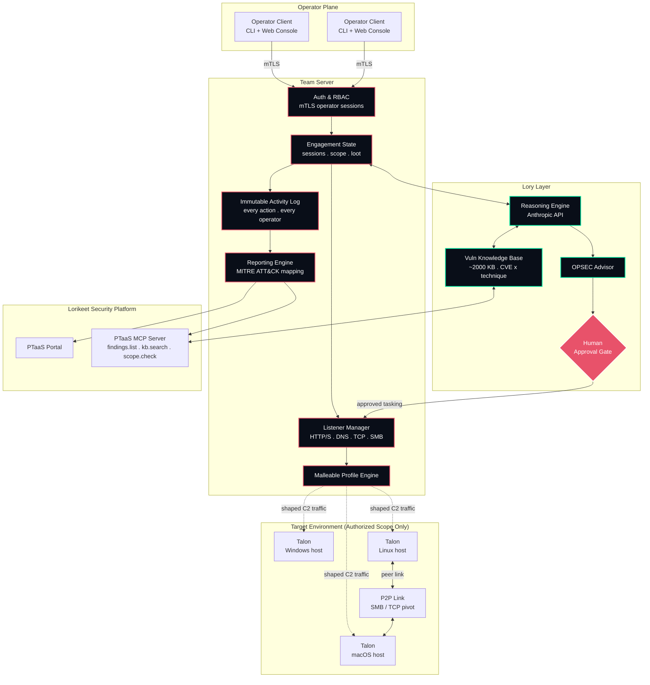
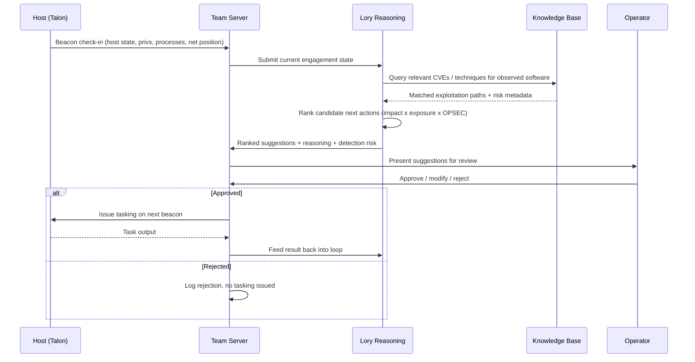
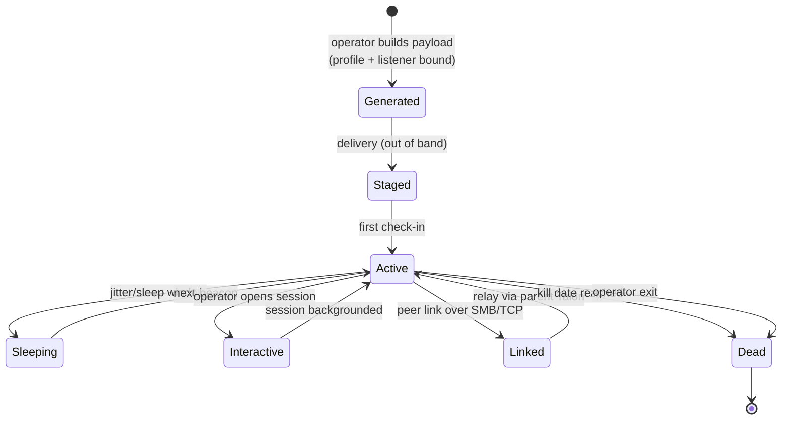
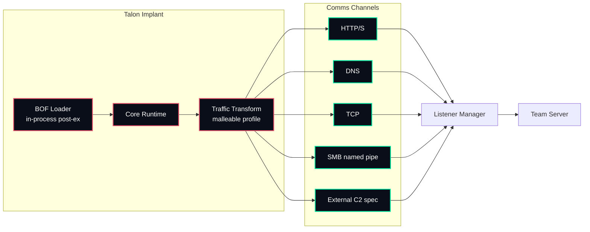

# TalonC2

**AI-Powered Command & Control Platform**

*Human-first. AI-powered.*


-00e5a0)

> **Early development.** The core C2 is not yet complete and is under active development. Nothing here is production ready. APIs, payloads, and architecture will change without notice. Do not rely on this for live engagements yet.

A next-generation C2 framework for authorized red team operations, adversary emulation, and full-scope offensive engagements. Built on the operational model that made Cobalt Strike the industry standard, TalonC2 adds an autonomous reasoning layer powered by **Lory**, Lorikeet Security's AI engine, that suggests next steps, automates tradecraft, and surfaces findings in real time, with a human operator approving every action.

> Authorized use only. Running TalonC2 against a target requires explicit written authorization (signed statement of work or equivalent scope agreement). See [Legal & Authorized Use](#legal--authorized-use).

---

## Table of Contents

- [Overview](#overview)
- [Why an AI-powered C2](#why-an-ai-powered-c2)
- [Architecture](#architecture)
  - [System topology](#system-topology)
  - [The Lory decision loop](#the-lory-decision-loop)
  - [Implant lifecycle](#implant-lifecycle)
  - [Comms & listener stack](#comms--listener-stack)
- [Components](#components)
- [Feature set](#feature-set)
- [The Lory layer](#the-lory-layer)
- [Comparison](#comparison)
- [Tech stack](#tech-stack)
- [Finding & telemetry schema](#finding--telemetry-schema)
- [Deployment](#deployment)
- [Operational security](#operational-security)
- [Roadmap](#roadmap)
- [Legal & authorized use](#legal--authorized-use)
- [License](#license)

---

## Overview

TalonC2 is Lorikeet Security's command and control framework for licensed offensive engagements. A central **team server** coordinates multiple operators against a shared picture of the target environment. Operators deploy **Talons** (implants) onto compromised hosts, drive post-exploitation, pivot through segmented networks, and produce MITRE ATT&CK-mapped reporting.

Where traditional C2 requires an operator to manually drive every beacon, pivot, and post-ex action, TalonC2 runs a **Lory decision loop** alongside the operator: Lory reads host and network state, proposes ranked next actions with reasoning and OPSEC risk notes, and waits for human approval before anything executes. The human decides, Lory advises, the team server logs both.

---

## Why an AI-powered C2

Red team engagements are bottlenecked on operator time and tradecraft recall. An experienced operator knows the right next move on a freshly compromised host; that knowledge is hard to scale across a team and across concurrent operations.

TalonC2 closes that gap. Lory carries the full vulnerability and technique knowledge base into every session, runs situational awareness automatically, and surfaces the moves a senior operator would make, ranked by impact and detection risk. Junior operators move faster and quieter. Senior operators stop wasting cycles on rote enumeration. Nothing fires without a human in the loop.

---

## Architecture

### System topology



**Design principles**

- **Human-in-the-loop is a hard gate, not a setting.** Every Lory-proposed action routes through the approval gate before tasking reaches a listener. There is no autonomous-execute mode.
- **Scope is enforced server-side.** Targets are checked against the engagement allowlist before any tasking is issued. Out-of-scope hosts are never tasked, by Lory or by a human.
- **Outbound-only implants.** Talons beacon out to listeners. The team server never reaches into the target network directly.
- **Everything is logged immutably.** Operator actions and Lory suggestions (approved and rejected) are written to an append-only activity log for engagement reconstruction and client reporting.

### The Lory decision loop



### Implant lifecycle



### Comms & listener stack



---

## Components

**Team Server**
The coordination core. Handles operator auth (mTLS), engagement state, listener management, malleable profile compilation, the immutable activity log, and report generation. Single Go binary, deploys anywhere.

**Operator Client**
Cross-platform (Linux, macOS, Windows). CLI for fast tasking plus a web console for the engagement picture, session graph, loot browser, and the Lory suggestion feed. Multiple operators connect concurrently.

**Talons (Implants)**
Modular cross-platform implants for Windows, Linux, and macOS. Configurable sleep, jitter, and kill dates. Asynchronous beaconing or interactive sessions. Peer-to-peer linking for reaching segmented internal networks.

**Lory Layer**
The reasoning engine, knowledge base, and OPSEC advisor that sit beside the team server. Reads engagement state, proposes ranked actions, and routes everything through the human approval gate.

---

## Feature set

### Listeners & comms
HTTP/HTTPS, DNS, TCP, SMB named pipe, and external C2 via a documented spec. Malleable profiles shape implant traffic to blend with the target environment and emulate specific threat actors.

### Payloads
Staged and stageless payloads, reflective DLLs, shellcode, and Beacon Object File (BOF) support for in-process post-ex without spawning new processes. Cross-compiler support for native implants.

### Post-exploitation
Process injection, token manipulation, credential harvesting, keylogging, screenshot capture, file browser, and an in-memory execution model that keeps tradecraft off disk.

### Pivoting
SOCKS proxy, port forwarding, and peer-to-peer implant linking over SMB and TCP for reaching segmented internal networks.

### Reporting
Auto-generated engagement reports mapped to MITRE ATT&CK, with full activity logs for every operator action. Findings export to the Lorikeet Security PTaaS platform over MCP.

---

## The Lory layer

This is the part Cobalt, Havoc, Sliver, and Empire do not have.

**Autonomous next-step suggestion**
Lory reads compromised host state (privileges, processes, network position, available creds) and proposes ranked next actions with reasoning and risk notes. The operator approves or rejects. Nothing fires without sign-off.

**Tradecraft automation**
Repeatable post-ex sequences (situational awareness, privilege checks, lateral movement candidate identification) run as Lory-driven playbooks instead of manual command chains.

**Natural language operations**
Operators describe intent in plain language ("enumerate domain admins reachable from this host") and Lory translates it into the correct implant commands, surfaced for approval.

**OPSEC advisor**
Before an action executes, Lory flags detection risk against the loaded malleable profile and the target's likely EDR posture, and suggests quieter alternatives.

**Live knowledge base**
Backed by the same vulnerability knowledge base powering Lory v2 (~2,000 KB of vuln and technique data), TalonC2 cross-references discovered software and surfaces relevant CVEs and exploitation paths inline.

**Human-in-the-loop by design**
Every AI suggestion requires operator approval. Lory advises, the human decides, the team server logs both. Non-negotiable and core to the platform's safety model.

---

## Comparison

| Capability | Cobalt Strike | Havoc | Sliver | Empire | TalonC2 |
|---|---|---|---|---|---|
| Multi-operator team server | Yes | Yes | Partial | No | Yes |
| Malleable C2 profiles | Yes | Partial | Limited | No | Yes |
| BOF support | Yes | Yes | Yes | No | Yes |
| Cross-platform implants | Limited | No | Yes | Limited | Yes |
| P2P pivoting (SMB/TCP) | Yes | Yes | Yes | Limited | Yes |
| AI next-step reasoning | No | No | No | No | Yes |
| Natural language ops | No | No | No | No | Yes |
| Live CVE cross-reference | No | No | No | No | Yes |
| OPSEC risk advisor | No | No | No | No | Yes |
| MITRE ATT&CK auto-mapping | Partial | No | No | No | Yes |
| Open source | No | Yes | Yes | Yes | Yes |

---

## Tech stack

| Layer | Choice | Rationale |
|---|---|---|
| Team server | Go | Single-binary deploy, strong concurrency for many operators/implants |
| Implants | Go + C/Rust | Native footprint flexibility, cross-compilation |
| Operator console | Web (navy `#090e18`, coral `#e8526a`, green `#00e5a0`, Poppins) | Lorikeet Security brand system |
| Reasoning | Anthropic API | Lory engine with engagement KB as retrieval context |
| Platform integration | MCP | Findings flow into PTaaS MCP server (`findings.list`, `kb.search`, `scope.check`, `ping`) |
| Transport security | mTLS (operators), shaped C2 (implants) | Operator auth + traffic blending |

---

## Finding & telemetry schema

Engagement telemetry and findings normalize to a consistent schema before export to the platform:

```json
{
  "engagement_id": "eng_<hex>",
  "talon_id": "tln_<hex>",
  "host": {
    "hostname": "WIN-EXAMPLE",
    "os": "windows",
    "privilege": "SYSTEM",
    "network_position": "internal-vlan-30"
  },
  "action": {
    "type": "lateral_movement",
    "command": "<tasking>",
    "operator": "parrotassassin15",
    "lory_suggested": true,
    "approved_by": "parrotassassin15",
    "mitre_attack": ["T1021.002"]
  },
  "opsec": {
    "detection_risk": "medium",
    "profile": "apt-emulation-01"
  },
  "timestamp": "2026-06-28T00:00:00Z"
}
```

Every record ties an action to an operator, flags whether Lory suggested it, records who approved it, and maps it to MITRE ATT&CK for reporting.

---

## Deployment

```bash
# Team server (single binary)
git clone https://github.com/<org>/talonc2.git
cd talonc2
make server

# Launch the team server
./talon-server --profile profiles/apt-emulation-01.profile \
               --scope engagements/<id>/scope.allowlist

# Operator client connects over mTLS
./talon-client connect --server <host>:50051 --identity operator.pem
```

Scope allowlist and malleable profile are required arguments. The server refuses to start without a scope file.

---

## Operational security

- **Scope gate before tasking.** No tasking reaches a listener for a host outside the engagement allowlist.
- **Outbound-only implants.** Talons initiate all connections; the server never dials into the target network.
- **Traffic shaping.** Malleable profiles blend C2 traffic with normal environment patterns.
- **In-memory post-ex.** BOF execution keeps tradecraft off disk.
- **Immutable logging.** Append-only activity log captures every operator action and every Lory suggestion, approved or rejected, for clean engagement reconstruction.

---

## Roadmap

```
Phase 1  Core C2          [###-------]  in development
Phase 2  Lory loop        [##--------]  early design
Phase 3  Malleable engine [#---------]  early design
Phase 4  P2P pivoting     [----------]  planned
Phase 5  Auto-reporting   [----------]  planned
```

**Phase 1 - Core C2** `in development`
Team server, operator client, cross-platform Talons, HTTP/S and DNS listeners, basic post-ex. Active work, not yet complete.

**Phase 2 - Lory loop** `in design`
Reasoning engine integration, suggestion ranking, human approval gate, KB-backed CVE cross-reference.

**Phase 3 - Malleable profile engine** `in design`
Profile compiler, threat-actor emulation templates, traffic transform pipeline.

**Phase 4 - P2P pivoting** `planned`
SMB and TCP peer linking, SOCKS proxy, port forwarding for segmented networks.

**Phase 5 - Automated reporting** `planned`
MITRE ATT&CK auto-mapping, MCP export to PTaaS, client-ready engagement reports.

---

## Legal & authorized use

TalonC2 is open-source software distributed for authorized security testing. The code being open does not authorize any particular use of it. Running TalonC2 against a target requires explicit written authorization (a signed statement of work or equivalent scope agreement). Operating this platform against systems you do not own or lack written authorization to test is illegal. The operator and their organization bear full responsibility for ensuring authorization before deployment. Lorikeet Corp accepts no liability for misuse.

---

## License

Open core.

The TalonC2 core (team server, Talons, listeners, malleable profile engine, pivoting) is released under the **GNU Affero General Public License v3.0 (AGPLv3)**. You are free to use, study, modify, and redistribute it. Derivatives and hosted forks must publish their source under the same license.

The **Lory layer** (reasoning engine, vulnerability knowledge base, OPSEC advisor) is a proprietary hosted component of the Lorikeet Security platform and is not covered by the open-source license. The core operates standalone; the Lory layer is an optional integration.

(c) Lorikeet Corp (operating as Lorikeet Security).

Provided for authorized security assessment only. Use against systems without explicit authorization is prohibited.

---

*Lorikeet Security. Human-first. AI-powered.*
*lorikeetsecurity.com | sales@lorikeetsecurity.com | +1 (888) 652-6479*
